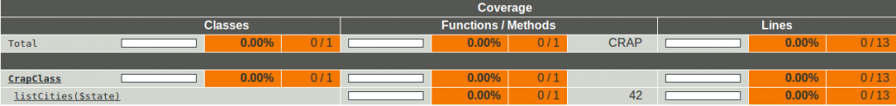
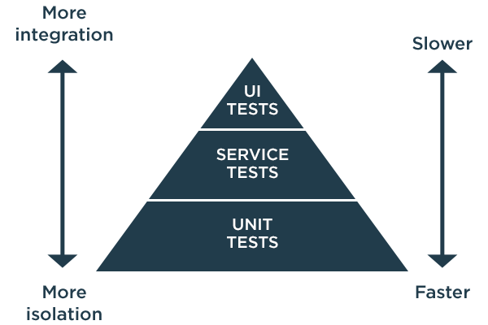

title: Road to efficient testing
class: animation-fade
layout: true

.bottom-bar[
  {{title}}
]

---

class: impact cover

# {{title}}
## Nov. 24, 2020

---

 
 
<strong>Laurent VOULLEMIER</strong>
 
 
@Sensiolabs  
Team P50/MiddleOffice

---

class: impact subcover

# Unit tests

---

# What is an unit test ?

<blockquote>
Unit tests are typically automated tests written and run by software developers to ensure that a section of an application (known as the "unit") meets its design and behaves as intended. (Wikipedia)  
</blockquote>
--
<blockquote>
Unit tests test individual units (modules, functions, classes) in isolation from the rest of the program. (Kent beck)  
</blockquote>
--
<blockquote>
The term "unit test" is unfortunate.  A unit is a small element of structure.  The TDD discipline causes us to write tests for small elements of behavior; not small elements of structure.  So a test per class is inappropriate. (Robert C. Martin)
</blockquote>
---

# F.I.R.S.T. principles

An unit test should be...
--

- **F**ast

--
- **I**solated

--
- **R**epeatable

--
- **S**elf-validating

--
- **T**imely
  
--
  
 
 
https://howtodoinjava.com/best-practices/first-principles-for-good-tests/
---
# Test a behavior, not an implementation

???
Explain how voters work in Symfony
---
# Test a behavior, not an implementation

???
- No mock (don't mock what you don't own)
- Protected methods are not tested directly
---
# How to test a configuration ?

???
getSubscribedEvents: other events can be added, priorities can be added... Test should not break
---
# Configuration may be a part of the behavior

---
# 100% code coverage ? Unit test everything ?
 
- Code coverage is a tool. It should not be the goal.
- Unit test low-complexity methods may be discussed.
- @covers annotation can help to mark as covered only code that is actually tested.
   
   
> If your unit tests cover 100% of your code, you're doing it wrong. Just my 2 cts. (Fabien Potencier)
???
- Controllers should not be unit tested
- Static analysis now replaces some basic tests
---
# Change Risk Anti-Patterns (CRAP) index
  
 
   

 
 
 
 
https://opnsrce.github.io/how-to-read-and-improve-the-c-r-a-p-index-of-your-code
---
class: impact subcover

# Integration tests
---
# Unit tests are green

???
But e2e and integration tests are not
---
# Test types
  

???
Service tests = Integration tests
---
# From here, external actors are allowed
 
   

- Database
- Filesystem
- ...
  
 
But fake objects can also be used (fake api client, fake mail server...)
---
# Fixtures

⚠️ Avoid to share fixtures between tests
  
## Tooling
- Faker / Alice fixtures (rely on Faker) / Doctrine fixtures  

## Speed up database fixtures
- In memory database (sqlite)/In memory filesystem (tmpfs)
- Transactions (Doctrine test bundle)
- Database dumps / Read only fixtures (but involves to have shared fixtures)  
  
⚠️ don't rely on auto-generated identifiers

???
- Generating and loading fixtures are often the bottleneck
- Avoid to share fixtures: a common base is possible but the base should be stable
- Don't rely on auto-generated identifiers: generators are incremented even when the transaction is cancelled (mysql, postgres...).
---
class: impact subcover

# End to end tests
---
# Rules of thumb
 
 
--

- Think like an end-user, user stories and acceptance tests are a good points to start
 
 
--

- Keep in mind critical paths to test (risk-based testing)
 
 
--

- Test UI against stable elements (find by aria roles, labels) 
      
---
# Gerkhin
 
 
--

- **Given**: set the application state, magic only happens here
 
 
--

- **When**: the user action
 
 
--

- **Then**: inspect the output of the system (UI) not something deeply buried inside (database state...) 

???
Common sense: don't test with a real browser if it's not needed
---
# Some other test types
 
 
- Mutation testing (Infection...)
  
- Performance tests (Blackfire...)
  
- Stress tests (Gatling...)
  
- Visual tests (Phantomcss...)
---
class: impact subcover

# Thank you for your attention.

